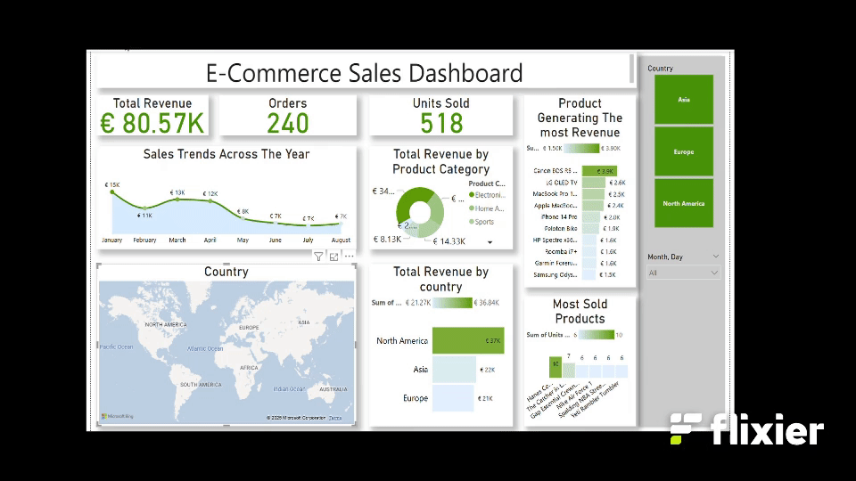

# E-Commerce Sales Dashboard

## Overview

## Business questions
1.	What was the company’s Overall Performance in terms of revenue?
2.	How were the sales Trend  Over Time?
3.	Which region had the highest and lowest sales and Are there any regional differences in product preferences?
4.	What are the top 5 best-selling products by units sold and revenue?

## Tools and Technologies
- **Data Analysis**: SQL Server 
- **Visualization**: Power BI (DAX formulas)

## Key Steps
1. **Initial exploration**: Used Microsoft excel to understand the data and identify necessary steps to proceed 
1. **Data Analysis**: Used SQL queries to answer business questions and DAX formulas to calculate KPIs.
2. **Visualization**: Created an interactive Power BI dashboard to showcase insights.

## Findings
- **Company’s Overall Performance in terms of revenue**

Results:

Insights:

The company's aggregate revenue across all products, regions, and time periods is $80,567.85.

Electronics (43.42%) is the clear market leader, generating nearly half of all revenue. Home Appliances (23.14%) and Sports (17.78%) are strong secondary categories.Clothing (10.09%), Beauty (3.25%), and Books (2.31%) are underperforming segments.

Top 3 categories (Electronics, Home Appliances, Sports) account for 84.34% of total revenue. Bottom 3 categories contribute just 15.66%.

- **Sales Trend Over Time**

Results:

Insights:
Revenue Declined from February to July 2024. After a strong January ($14,548.32), revenue dropped sharply in February (-25.74%) and continued declining until July.
The steepest drop was in May (-32.09%), followed by June (-12.67%) and July (-7.96%).Slight Recovery in August.Revenue increased by 7.08% , breaking the 6-month decline.

Beauty Products suffered the steepest decline, plummeting from 699.95 January to just 170.70 in August—a 75.6% decrease. 
Despite being the highest-revenue category in January (7,999.90),Electronics saw a 61.7%  drop (3,066.96) by August. Home Appliances saw a 23.1% drop, possibly due to economic tightening (big-ticket purchases slowing down). Sports was the least affected (-10.8%), indicating stable demand, possibly tied to seasonal fitness trends.

-**Region with the highest and lowest sales and Are there any regional differences in product preferences**

Results:

- Regional differences in product preferences

Insights:

North America dominated with $36,844.34 in sales, ranking #1. Asia followed at 22,455.45, while Europe trailed slightly at 21,268.06.
North America is the top-performing market, contributing significantly more to revenue than Asia or Europe. Europe, while competitive, had the lowest sales among the three regions.

North America’s reliance on Electronics (95% of its revenue) indicates a tech-centric market. Europe’s preference for Home Appliances suggests a focus on household investments. Asia’s Sports category lead aligns with growing health and wellness trends.

- **Top 5 best-selling products by units sold and revenue**

Results:

Insights:

These products generated the highest total revenue, indicating strong profitability. Electronics dominate revenue, with high-ticket items (cameras, TVs, laptops) leading. 5 Products by Units Sold (Highest Volume)
These products had the highest sales volume, though often at lower price points:
Hanes ComfortSoft T-Shirt	, The Catcher in the Rye, Yeti Rambler Tumbler, Spalding NBA Street Basketball and Nike Air Force 1. these products are affordable, everyday items (apparel, books, accessories)  and drive volume. No overlap with revenue leaders, highlighting a price vs. volume tradeoff.

## Visualisation

[CLICK HERE TO INTERACT WITH THE DASHBOARD](https://app.fabric.microsoft.com/view?r=eyJrIjoiZThiYzAzYmUtODA1Yi00NzM4LTkyNjUtNTZhMWJiMGNjZDBmIiwidCI6ImUwMmQxZTM1LWZmYjYtNGY0My1hZWVhLWFjNzlhZTBmM2M1ZSJ9)

## Recommendations 

**1. Revenue Optimization Strategies**

Leveraging High-Performing Categories
The Electronics category dominates, contributing 43.4% of total revenue, followed by Home Appliances (23.1%) and Sports (17.8%). To maximize profitability in these segments:

Electronics: Focus on premium, high-margin products such as cameras, laptops, and smart devices. Bundling accessories (e.g., camera kits with lenses and cases) can increase average order value.
Home Appliances: Promote energy-efficient and smart home-compatible models. Offering extended warranties or installation services could enhance customer retention.
Sports: Capitalize on seasonal demand—fitness gear in Q1, outdoor equipment in summer. Partnerships with fitness influencers could amplify reach.

Revitalizing Underperforming Categories
Beauty Products (3.3%) and Books (2.3%) lag significantly. To improve performance:
Beauty Products: Introduce subscription models (e.g., monthly beauty boxes) or bundle with best-selling items (e.g., skincare with apparel).
Books: Explore digital expansions (e.g., e-books) or curated bundles (e.g., "Book + Coffee Mug" sets).

**2. Regional Growth Opportunities**

North America (Highest Revenue: $36,844.34). As the top revenue-generating region, North America’s strong demand for Electronics suggests a tech-savvy consumer base. Offer Black Friday/Cyber Monday deals on high-ticket electronics.Also promote trade-in programs for older devices.

Europe (Strong in Home Appliances: $18,646.16). Europe’s preference for Home Appliances indicates a market inclined toward sustainability. Promote Eco-Friendly Messaging such as Highlight energy-saving features and pair appliances with smart home accessories.

Asia (Sports-Leading: $14,326.52). The region focuses on Sports aligns with growing fitness trends. Try Local Collaborations, like Partnering with regional athletes for endorsements. Also promote sports gear ahead of major events.

**3. Product-Level Adjustments**

High-Revenue, Low-Volume Products (e.g., Canon EOS R5 Camera)
These items drive profitability but sell in limited quantities. To boost sales, Offer "0% APR for 12 months" to reduce purchase barriers. Include limited-edition accessories to create urgency.

High-Volume, Low-Revenue Products (e.g., Hanes T-Shirts)
These products attract customers but contribute less to revenue. Use them in "Buy 2, Get 1 Free" promotions to increase foot traffic and also try Pairing them  with higher-margin items (e.g., "T-Shirt + Premium Water Bottle").
