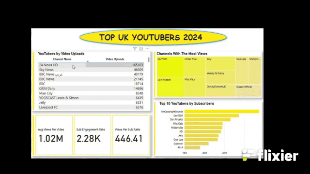

# Analysis of UK YouTube Channels for Marketing Campaign Optimization

## Overview
The marketing team aims to deploy a dashboard that analyzes UK YouTube channel data. The dashboard will highlight top-performing channels based on metrics like average views, subscription base, and engagement rates. This will enable the team to optimize marketing campaigns by partnering with the most effective YouTubers.
The objective is to identify top-performing UK YouTube channels based on key performance indicators (KPIs) such as subscribers, views, and engagement. This will help the marketing head make data-driven decisions about which YouTubers to collaborate with for future campaigns.

## Business Questions
1. Who are the top 10 YouTubers with the most subscribers?
2. Which 3 channels have uploaded the most videos?
3. Which 3 channels have the most views?
4. Which 3 channels have the highest average views per video?
5. Which 3 channels have the highest views per subscriber ratio?
6. Which 3 channels have the highest subscriber engagement rate per video uploaded?

## Tools and Technologies
- **Data Cleaning and Analysis**: SQL Server 
- **Visualization**: Power BI (DAX formulas)
- **Documentation**: Microsoft Word

## Key Steps
1. **Data Cleaning**: Removed duplicates and standardized channel names using SQL. 
2. **Data Analysis**: Used SQL queries to answer business questions and calculate KPIs.
3. **Visualization**: Created an interactive Power BI dashboard to showcase insights.
4. **Documentation**: Summarized findings and provided actionable recommendations.

## Findings
- **Top 10 YouTubers with the Most Subscribers**

Results:
| CHANNEL NAME       | SUBSCRIBERS  |
|--------------------|--------------|
| NOCOPYRIGHTSOUNDS  | 33,600,000   |
| DANTDM             | 28,600,000   |
| DAN RHODES         | 26,500,000   |
| MISS KATY          | 24,500,000   |
| MISTER MAX         | 24,400,000   |
| KSI                | 24,100,000   |
| JELLY              | 23,500,000   |
| DUA LIPA           | 23,300,000   |
| SIDEMEN            | 21,000,000   |
| ALI-A              | 18,900,000   |

Insights:
NoCopyrightSounds (music) and DanTDM (gaming) lead with the highest subscriber counts, reflecting the popularity of music and gaming content. Channels like KSI and Sidemen (gaming/entertainment) highlight the staying power of long-term creators with loyal fanbases. Dua Lipa’s presence suggests music artists use YouTube as a key platform for fan engagement.

- **Top 3 Channels with the Most Videos Uploaded**

Results:
| CHANNEL NAME       | VIDEO UPLOADED|
|--------------------|---------------|
| 24 NEWS HD         |   165,103     |
| SKY NEWS           |  46,009       |
| BBC NEWS           | 40,179        |

Insights:
News channels like 24 News HD and Sky News upload daily or hourly content to stay current, leading to exceptionally high video counts. While these channels produce massive content volumes, their average views per video may be lower compared to entertainment-focused channels.

- **Top 3 Channels with the Most Views**

Results:
| CHANNEL NAME     | TOTAL VIEWS     |
|------------------|-----------------|
| DANTDM	         | 19,775,950,848  |
| DAN RHODES	     | 18,558,842,880  |
| MISTER MAX	     | 15,973,601,280  |

Insights:
DanTDM and Dan Rhodes (gaming/entertainment) have amassed billions of views, indicating sustained audience interest over years. These channels likely cater to younger audiences, leveraging trends like gaming commentary or family-friendly content.

- **Top 3 Channels with the Highest Average Views per Video**

Results:
| CHANNEL NAME     |AVG VIEWS PER VIDEO |
|------------------|--------------------|
| MARK RONSON	     |     322,787,507    |
| JESSIE J	       |      59,772,603    |
| DUA LIPA	       |      57,623,427    |

Insights:
Mark Ronson’s 322 million average views per video suggests viral music videos or collaborations. Music artists like Jessie J and Dua Lipa achieve massive reach per video, even with fewer uploads, highlighting YouTube’s role in music promotion.

- **Top 3 Channels with the Highest Views per Subscriber Ratio**

Results:
| CHANNEL NAME     |VIEWS PER SUBSCRIBER RATIO |
|------------------|---------------------------|
| GRM DAILY	       |        1,185.79           |
|NICKELODEON UK    |	      1,061.04           |
| DISNEYJUNIORUK	 |        1,031.97           |

Insights:
GRM Daily (music/hip-hop) has a ratio of 1,185 views per subscriber, meaning non-subscribers heavily consume their content (e.g., via shares or recommendations). Nickelodeon and DisneyJuniorUK’s high ratios suggest their videos are watched repeatedly by the same audience (e.g., children) or shared among families.

- **Top 3 Channels with the Highest Subscriber Engagement Rate per Video**

Results:
| CHANNEL NAME     |     ENGAGEMENT RATE       |
|------------------|---------------------------|
|MARK RONSON	     |              343,000      |
|JESSIE J	         |              110,416      |
| DUA LIPA	       |              104,954      |

Insights:
Mark Ronson’s 343,000 engagement rate reflects highly shareable or viral content, despite fewer uploads. Artists like Jessie J and Dua Lipa leverage YouTube for music videos that attract repeat views, even with smaller subscriber bases relative to their view counts.

  
## Visualisation

[VIEW MY INTERACTIVE POWER BI REPORT HERE](https://app.fabric.microsoft.com/view?r=eyJrIjoiMmI2ZWMxODMtMGZhYi00MWU1LWIxZDctNGVlNDYwNmZkMTk0IiwidCI6ImUwMmQxZTM1LWZmYjYtNGY0My1hZWVhLWFjNzlhZTBmM2M1ZSJ9)

## Recommendations 
**1. Prioritize Channels with High Engagement Rates**

Leverage creators with proven audience interaction to drive conversions. High engagement rates correlate with better ad recall and conversion potential. For example, a channel with 300,000+ views per video likely has an audience primed to act on recommendations.

**2. Optimize Campaign Costs with Cost-Per-Engagement (CPE)**

Minimize wasted spend by targeting cost-efficient creators. Channels like GRM Daily or DisneyJuniorUK offer lower CPE due to their high views-to-subscriber ratios, maximizing reach per dollar spent.

**3. Estimate Product Conversion Rates**

Link engagement metrics to actual sales/conversions. Channels like KSI (gaming) may have lower conversion rates but higher reach, while Mark Ronson (music) could drive fewer but higher-quality leads.

**4. Calculate Potential ROI**

Ensure campaigns generate profitable returns. Channels with lower engagement rates (e.g., 24 News HD) may require higher budgets to achieve the same ROI as high-engagement creators.
